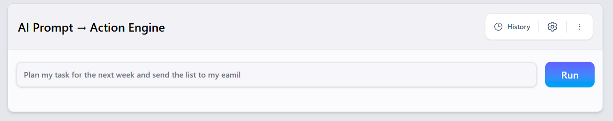
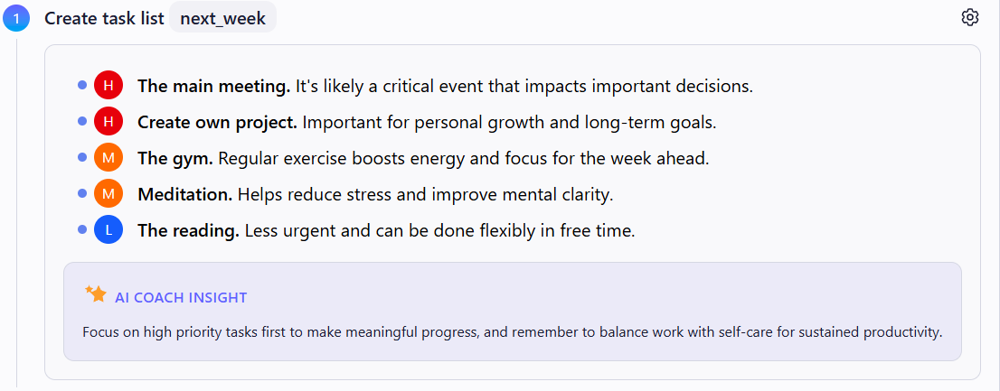
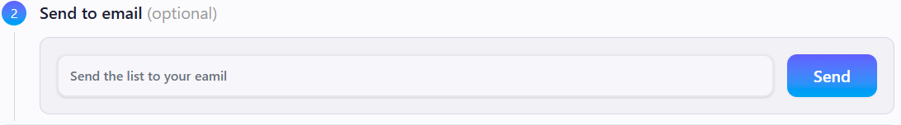
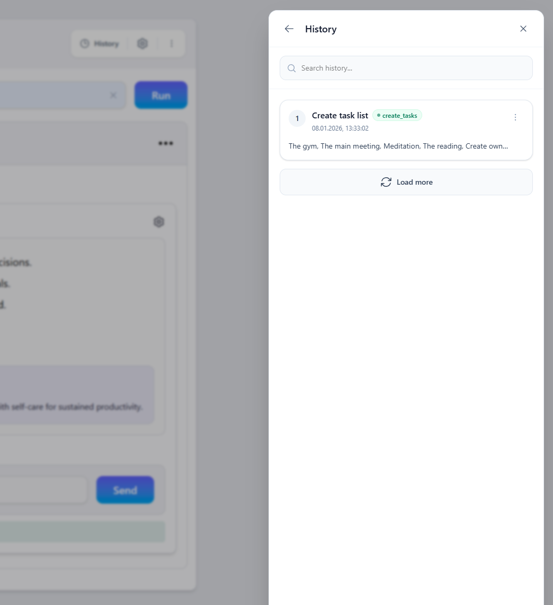
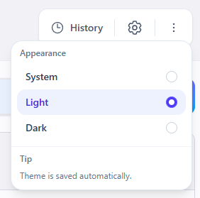
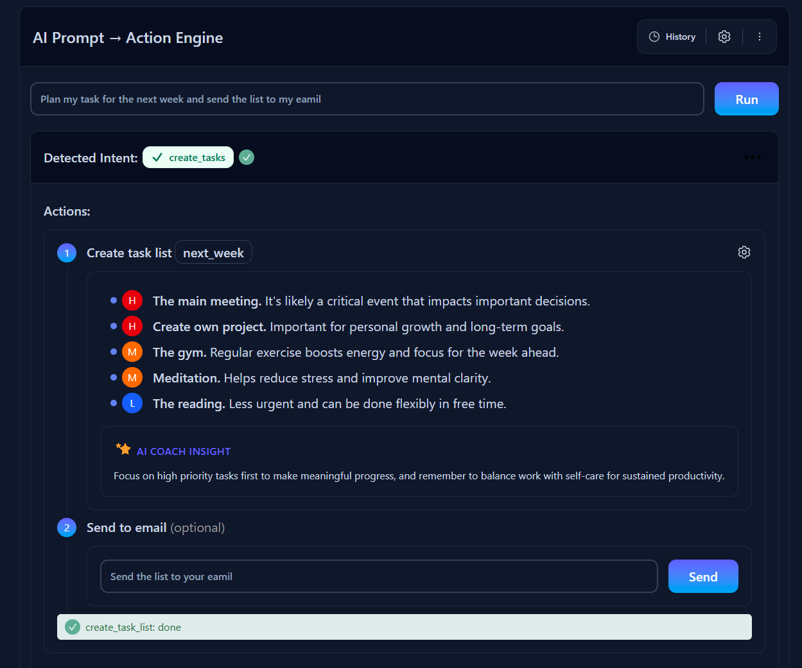

# AI Prompt → Action Engine

AI Prompt → Action Engine is a web application that transforms a plain text user prompt into **clear, structured actions** with priorities and actionable results.

The product helps users:
- understand **what they really want to do**
- convert text into a **concrete action plan**
- assign **priorities** to tasks
- optionally **send the result by email**

---

## 🚀 What the App Does

1. The user writes a plan in natural language  
2. AI analyzes the input and detects the **intent**
3. The app shows a **preview of the understanding**
4. The user confirms the plan
5. AI:
   - generates a task list
   - assigns priorities
   - adds a short motivational tip
6. (Optional) The result can be **sent to email**

---

## 🧠 Core Idea

> **Understanding first. Execution second.**

The AI never performs actions immediately.

Instead, it:
- explains **how it understood the request**
- shows **what will be done**
- waits for explicit user confirmation

This makes the process:
- transparent
- safe
- user-controlled

---

## ✍️ How to Use

### 1. Write Your Plan

Enter your plan in plain text, for example:




---

### 2. Click **Run**

The AI will:
- detect the intent (e.g. `create_tasks`)
- extract mentioned tasks
- show a preview of the plan


---

### 3. Review and Click **Confirm**

After confirmation:
- tasks are enriched with priorities (`high / medium / low`)
- a short **Coach tip** is added



---

### 4. (Optional) Send to Email

You can:
- enter an email address
- send the generated plan with one click



---

## 🗂 History

The app keeps a history of previous runs:
- past prompts
- detected intents
- short previews
- execution timestamps

You can:
- reopen previous plans
- restore results
- delete individual history items



---

## ⚙️ Settings

In the settings menu you can:
- switch theme (Light / Dark / System)
- reset the current session



---

## 🌙 Dark Theme Support

The application supports:
- Light theme
- Dark theme
- System theme

Theme changes are applied globally and persist across sessions.



---

## 🛠 Tech Stack

**Frontend**
- React
- TypeScript
- Tailwind CSS (v4)
- Vite

**Backend**
- Node.js
- Express
- OpenAI API
- Zod (schema validation)

**Email**
- Resend API

---

## 🔐 Architecture & Approach

- Clear separation of responsibilities:
  - `Run` → planning only
  - `Execute` → final execution
- Strict API contracts validated with Zod
- AI responses are always structured JSON
- Fallback logic is implemented for AI failures

---

## 📦 Local Development

```bash
# Frontend
npm install
npm run dev

# Backend
node index.js


